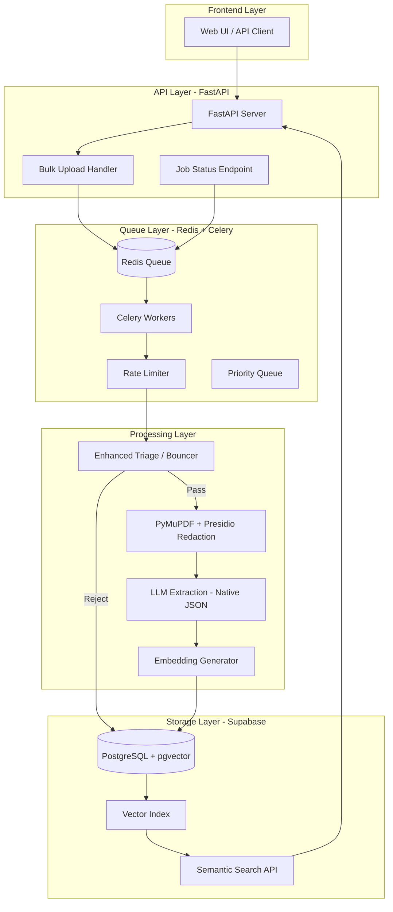
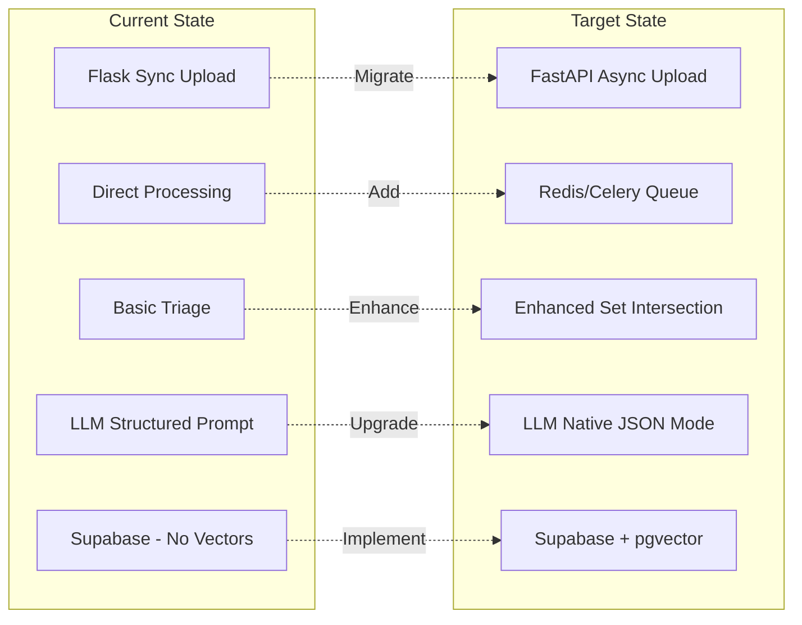
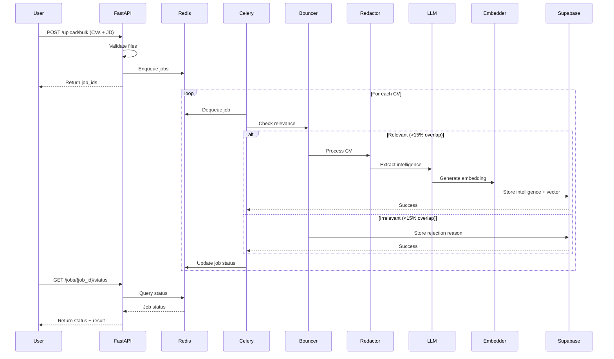
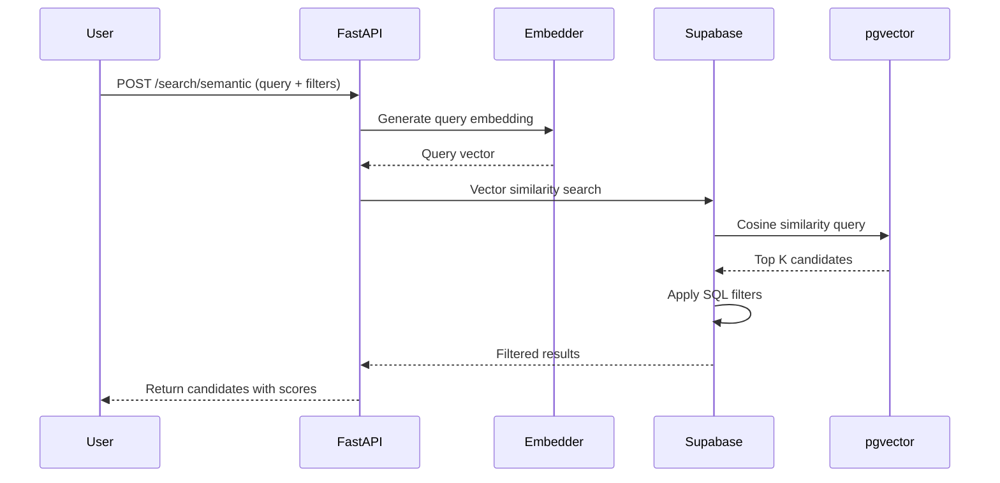
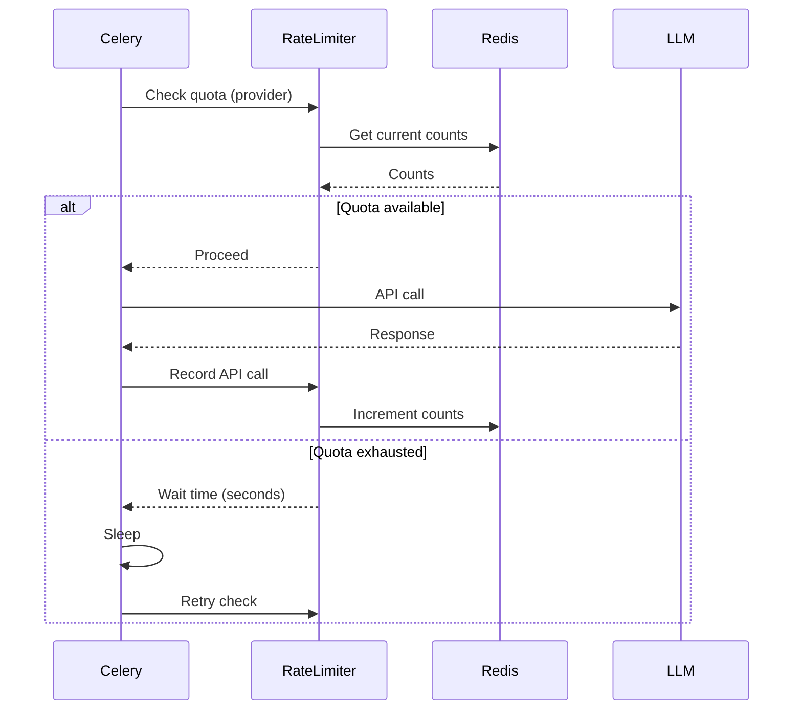

# Design Document: CV Architecture Improvements

## Overview

This design addresses the missing architectural components in the CV Redaction Pipeline project to align the current implementation with the ideal 6-component architecture. The current system successfully implements CV parsing, PII redaction, and LLM-based extraction, but lacks critical infrastructure for production scalability: asynchronous queue management, semantic search capabilities, and enhanced triage logic. This design proposes implementing Redis/Celery for async processing and rate limiting, pgvector embeddings for semantic candidate search, enhanced "bouncer" logic using set intersection, and migration considerations for FastAPI.

## Current Architecture Analysis

### Implemented Components

**Component 2: Text Parsing & Redaction (✅ Complete)**
- Implementation: `universal_pipeline_engine.py` with PyMuPDF/pdfplumber
- Features: Multi-pipeline support (StandardATS, Naukri, MultiColumn, Docx), Presidio-based PII detection, rule-based redaction with configurable patterns
- Status: Production-ready with comprehensive redaction markers

**Component 3: Initial Triage (✅ Basic Implementation)**
- Location: `cv_intelligence_extractor.py` - `extract_intelligence()` method
- Current logic: Simple keyword overlap check (5% threshold), CV length validation (50 words minimum)
- Gap: Needs enhancement with set intersection approach for better accuracy

**Component 5: LLM Extraction (✅ Implemented, needs enhancement)**
- Implementation: `cv_intelligence_extractor.py` with `llm_batch_processor.py`
- Providers: Gemini, OpenAI, Anthropic, Ollama
- Current: Structured prompts with prose parsing
- Gap: Not using native JSON mode for LLM APIs

**Component 6: Database Storage (⚠️ Partial)**
- Implementation: `supabase_storage.py` with Supabase client
- Features: CV intelligence storage, SQL filtering, filename mapping
- Gap: `semantic_search()` method returns empty - pgvector embeddings not implemented

### Missing Components

**Component 1: File Upload (❌ Needs Replacement)**
- Current: Flask-based synchronous upload in `app.py`
- Gaps: No bulk upload support, no async handling, blocking I/O operations
- Impact: Cannot handle concurrent uploads efficiently

**Component 4: Queue System (❌ Critical Missing)**
- Current: Synchronous processing in Flask routes
- Gaps: No Redis/Celery infrastructure, no rate limiting, no job prioritization
- Impact: API quota exhaustion, poor scalability, no retry logic

## Architecture

### Target Architecture Diagram



### Current vs Target State



## Components and Interfaces

### Component 1: FastAPI Async Upload Handler

**Purpose**: Replace Flask with FastAPI for async bulk upload support

**Interface**:
```python
from fastapi import FastAPI, UploadFile, BackgroundTasks
from typing import List

class AsyncUploadHandler:
    async def upload_single(self, file: UploadFile, job_description: str) -> dict
    async def upload_bulk(self, files: List[UploadFile], job_description: str) -> dict
    async def get_job_status(self, job_id: str) -> dict
```

**Responsibilities**:
- Accept single or bulk CV uploads asynchronously
- Validate file types and sizes (PDF, DOCX, max 16MB)
- Generate unique job IDs for tracking
- Enqueue processing jobs to Redis
- Return immediate response with job ID

**Migration Strategy**:
- Phase 1: Run FastAPI alongside Flask (different ports)
- Phase 2: Migrate upload endpoints to FastAPI
- Phase 3: Deprecate Flask routes
- Phase 4: Full cutover to FastAPI

### Component 4: Redis + Celery Queue System

**Purpose**: Async job processing with rate limiting and retry logic

**Interface**:
```python
from celery import Celery
from redis import Redis

class QueueManager:
    def enqueue_cv_processing(self, cv_path: str, job_description: str, priority: int) -> str
    def get_job_status(self, job_id: str) -> dict
    def cancel_job(self, job_id: str) -> bool
    def get_queue_stats(self) -> dict

class RateLimiter:
    def check_quota(self, api_provider: str) -> bool
    def record_api_call(self, api_provider: str) -> None
    def get_wait_time(self, api_provider: str) -> int
```

**Responsibilities**:
- Queue CV processing jobs with priority levels
- Rate limit LLM API calls (10 RPM for free tier, configurable)
- Retry failed jobs with exponential backoff
- Track job status (queued, processing, completed, failed)
- Provide queue statistics and monitoring

**Queue Priority Levels**:
- HIGH (0): Urgent candidate reviews
- NORMAL (5): Standard processing
- LOW (10): Batch processing

### Component 3: Enhanced Triage / "The Bouncer"

**Purpose**: Auto-reject irrelevant CVs before expensive LLM calls using set intersection

**Interface**:
```python
class EnhancedTriageEngine:
    def should_process(self, cv_text: str, job_description: str) -> tuple[bool, str, float]
    def extract_keywords(self, text: str) -> set[str]
    def compute_relevance_score(self, cv_keywords: set, jd_keywords: set) -> float
```

**Responsibilities**:
- Extract meaningful keywords from CV and JD (5+ chars, excluding stopwords)
- Compute set intersection overlap ratio
- Apply multi-tier rejection thresholds
- Return decision with confidence score and reason

**Triage Logic**:
```python
# Tier 1: Extreme mismatch (< 5% overlap) → Auto-reject
# Tier 2: Poor match (5-15% overlap) → Flag for review
# Tier 3: Moderate match (15-30% overlap) → Process with low priority
# Tier 4: Good match (> 30% overlap) → Process with normal priority
```

### Component 5: Native JSON Mode LLM Extraction

**Purpose**: Use native JSON mode for structured extraction instead of prose parsing

**Interface**:
```python
class NativeJSONExtractor:
    def extract_with_json_mode(self, cv_text: str, job_description: str) -> dict
    def validate_json_schema(self, response: dict) -> bool
    def fallback_to_structured_prompt(self, cv_text: str, job_description: str) -> dict
```

**Responsibilities**:
- Use OpenAI's JSON mode or Gemini's response_mime_type="application/json"
- Define strict JSON schema for extraction
- Validate response against schema
- Fallback to current structured prompt parsing if JSON mode fails

**JSON Schema**:
```python
{
    "anonymized_id": "string",
    "verdict": "enum[SHORTLIST, BACKUP, REVIEW]",
    "confidence_score": "integer[0-100]",
    "match_score": "integer[0-100]",
    "years_experience": "float",
    "seniority_level": "enum[ENTRY, MID, SENIOR, LEAD, EXECUTIVE]",
    "core_technical_skills": "array[string]",
    "secondary_technical_skills": "array[string]",
    "primary_domain": "string",
    "fitment_analysis": "array[object]",
    "verdict_reason": "string"
}
```

### Component 6: pgvector Semantic Search

**Purpose**: Implement vector embeddings for semantic candidate search

**Interface**:
```python
class VectorSearchEngine:
    def generate_embedding(self, text: str) -> list[float]
    def store_embedding(self, anonymized_id: str, embedding: list[float]) -> None
    def semantic_search(self, query_text: str, limit: int, threshold: float) -> list[dict]
    def hybrid_search(self, query_text: str, filters: dict) -> list[dict]
```

**Responsibilities**:
- Generate embeddings using sentence-transformers or OpenAI
- Store embeddings in Supabase pgvector column
- Perform cosine similarity search
- Combine semantic search with SQL filters (hybrid search)

**Embedding Strategy**:
- Model: `all-MiniLM-L6-v2` (384 dimensions, fast, local)
- Alternative: OpenAI `text-embedding-3-small` (1536 dimensions, API-based)
- Input: Concatenate cleaned_narrative + core_technical_skills + primary_domain
- Index: IVFFlat with 100 lists for fast approximate search

## Data Models

### Job Queue Model

```python
class ProcessingJob:
    job_id: str  # UUID
    cv_path: str
    job_description: str
    priority: int  # 0=HIGH, 5=NORMAL, 10=LOW
    status: str  # queued, processing, completed, failed
    created_at: datetime
    started_at: datetime | None
    completed_at: datetime | None
    result: dict | None
    error: str | None
    retry_count: int
    max_retries: int
```

**Validation Rules**:
- job_id must be unique UUID
- priority must be 0, 5, or 10
- status must be one of: queued, processing, completed, failed
- retry_count must be <= max_retries

### Rate Limit Model

```python
class APIQuota:
    provider: str  # gemini, openai, anthropic
    requests_per_minute: int
    requests_per_day: int
    current_minute_count: int
    current_day_count: int
    last_reset_minute: datetime
    last_reset_day: datetime
    wait_time_seconds: int
```

**Validation Rules**:
- requests_per_minute > 0
- requests_per_day > 0
- current counts reset at appropriate intervals

### Vector Embedding Model

```python
class CVEmbedding:
    anonymized_id: str  # Foreign key to cv_intelligence
    embedding: list[float]  # 384 or 1536 dimensions
    embedding_model: str  # Model used to generate
    embedding_text: str  # Text that was embedded
    created_at: datetime
```

**Validation Rules**:
- embedding dimension must match model (384 for MiniLM, 1536 for OpenAI)
- anonymized_id must exist in cv_intelligence table

## Sequence Diagrams

### Async Upload and Processing Flow



### Semantic Search Flow



### Rate Limiting Flow



## Error Handling

### Error Scenario 1: API Quota Exhausted

**Condition**: LLM API returns 429 (rate limit exceeded) or daily quota exhausted
**Response**: 
- Celery worker pauses job and returns to queue with delay
- RateLimiter calculates wait time based on quota reset
- Job status updated to "rate_limited" with retry_at timestamp
**Recovery**: 
- Automatic retry after wait time
- If quota exhausted for the day, jobs remain queued until next day
- User notified via job status endpoint

### Error Scenario 2: CV Parsing Failure

**Condition**: PyMuPDF/pdfplumber cannot extract text (scanned PDF, corrupted file)
**Response**:
- Pipeline returns error with reason "text_extraction_failed"
- Job marked as "failed" with detailed error message
- Original file preserved for manual review
**Recovery**:
- User notified to provide OCR-processed version
- Manual intervention required

### Error Scenario 3: Supabase Connection Timeout

**Condition**: Supabase unreachable or query timeout (>5 seconds)
**Response**:
- Fallback to local JSON storage in `llm_analysis/` directory
- Job marked as "completed_local" status
- Warning logged for admin review
**Recovery**:
- Background sync job retries Supabase upload
- Data preserved locally until successful sync

### Error Scenario 4: Invalid JSON Response from LLM

**Condition**: LLM returns malformed JSON or missing required fields
**Response**:
- Validator detects schema violation
- Fallback to structured prompt parsing (current implementation)
- Warning logged with raw LLM response
**Recovery**:
- If fallback succeeds, job completes normally
- If fallback fails, job marked as "failed" with human review flag

### Error Scenario 5: Redis Connection Lost

**Condition**: Redis server unavailable or connection timeout
**Response**:
- Celery workers enter reconnection loop with exponential backoff
- New jobs rejected with "queue_unavailable" error
- In-progress jobs preserved in worker memory
**Recovery**:
- Automatic reconnection when Redis available
- Jobs resume from last checkpoint
- User notified of temporary service degradation

## Testing Strategy

### Unit Testing Approach

**Component 1: FastAPI Upload Handler**
- Test single file upload with valid PDF/DOCX
- Test bulk upload with mixed file types
- Test file size validation (reject >16MB)
- Test invalid file type rejection
- Test job ID generation uniqueness
- Mock Redis enqueue operations

**Component 4: Queue System**
- Test job enqueue with different priorities
- Test job status retrieval
- Test job cancellation
- Test rate limiter quota tracking
- Test retry logic with exponential backoff
- Mock Redis and Celery operations

**Component 3: Enhanced Triage**
- Test keyword extraction with various CV formats
- Test set intersection calculation
- Test threshold-based rejection (5%, 15%, 30%)
- Test edge cases (empty CV, no overlap, 100% overlap)
- Verify stopword filtering

**Component 5: Native JSON Mode**
- Test JSON schema validation with valid responses
- Test schema validation with invalid responses
- Test fallback to structured prompt parsing
- Mock LLM API responses
- Verify all required fields present

**Component 6: Vector Search**
- Test embedding generation with sentence-transformers
- Test embedding storage in Supabase
- Test cosine similarity search
- Test hybrid search (semantic + SQL filters)
- Mock Supabase pgvector operations

**Coverage Goals**: 80% line coverage, 90% branch coverage for critical paths

### Integration Testing Approach

**End-to-End Upload Flow**
- Upload real CV → Queue → Process → Store → Retrieve
- Verify job status transitions (queued → processing → completed)
- Verify data integrity in Supabase
- Test with multiple concurrent uploads

**Rate Limiting Integration**
- Simulate API quota exhaustion
- Verify jobs pause and resume correctly
- Test with multiple workers competing for quota

**Semantic Search Integration**
- Store 10 test CVs with embeddings
- Query with natural language
- Verify top-K results match expected candidates
- Test with various similarity thresholds

**Fallback Scenarios**
- Disconnect Supabase mid-processing
- Verify local JSON fallback works
- Reconnect and verify sync

## Performance Considerations

### Throughput Targets

- **Upload**: 100 CVs/minute (bulk upload)
- **Processing**: 10 CVs/minute (limited by LLM API rate)
- **Search**: <500ms for semantic search (top 10 results)
- **Queue latency**: <100ms for job enqueue/dequeue

### Optimization Strategies

**1. Parallel Processing**
- Run multiple Celery workers (4-8 workers recommended)
- Each worker processes one CV at a time
- Redis queue distributes jobs across workers

**2. Caching**
- Cache JD keyword extraction (same JD used for multiple CVs)
- Cache embedding model in memory (avoid reload per job)
- Redis cache for frequently accessed job statuses

**3. Batch Operations**
- Batch embed multiple CVs in single API call (if provider supports)
- Batch insert embeddings to Supabase (10-50 records per transaction)

**4. Index Optimization**
- pgvector IVFFlat index with 100 lists for <10K candidates
- Increase to 1000 lists for >100K candidates
- GIN indexes on JSONB fields for fast skill filtering

**5. Connection Pooling**
- Supabase connection pool: 10-20 connections
- Redis connection pool: 5-10 connections per worker

### Scalability Limits

- **Current bottleneck**: LLM API rate limits (10 RPM free tier)
- **With paid tier**: 60 RPM → 600 CVs/hour
- **Database**: Supabase free tier supports 500MB, upgrade for >10K CVs
- **Redis**: Can handle 100K+ jobs in queue with minimal memory

## Security Considerations

### PII Protection

**Requirement**: Only anonymized CVs stored in database
**Implementation**:
- Verify redaction markers before Supabase insert
- Reject storage if `is_cv_anonymized()` returns False
- Sanitize filenames before database storage
- Filename mapping table isolated with RLS policies

### API Authentication

**Requirement**: Secure FastAPI endpoints
**Implementation**:
- API key authentication for upload endpoints
- JWT tokens for user sessions
- Rate limiting per API key (100 requests/hour)
- CORS configuration for allowed origins

### Data Encryption

**Requirement**: Protect sensitive data in transit and at rest
**Implementation**:
- HTTPS/TLS for all API communication
- Supabase RLS policies for row-level access control
- Redis password authentication
- Environment variables for secrets (never commit .env)

### Audit Trail

**Requirement**: Track all processing decisions
**Implementation**:
- Log all triage rejections with reasons
- Store LLM prompts and raw responses
- Track recruiter overrides with timestamps
- Immutable audit log table in Supabase

## Dependencies

### New Dependencies

**Python Packages**:
```
fastapi>=0.104.0
uvicorn[standard]>=0.24.0
celery>=5.3.0
redis>=5.0.0
sentence-transformers>=2.2.0
pgvector>=0.2.0
```

**Infrastructure**:
- Redis server (local or cloud: Redis Cloud, AWS ElastiCache)
- Celery workers (run as systemd services or Docker containers)
- Supabase with pgvector extension enabled

### Existing Dependencies (No Changes)

- pymupdf==1.23.8
- pdfplumber==0.10.3
- presidio-analyzer==2.2.354
- presidio-anonymizer==2.2.354
- spacy==3.7.2
- openai>=1.12.0
- anthropic>=0.18.0
- google-genai>=0.2.0
- supabase>=2.0.0
- Flask==3.0.0 (deprecated after FastAPI migration)

## Implementation Priority

### Phase 1: Queue System (Highest Priority)

**Why First**: Solves immediate pain point of API quota exhaustion and enables async processing

**Tasks**:
1. Install Redis and Celery
2. Create `queue_manager.py` with job enqueue/dequeue logic
3. Create `celery_worker.py` with CV processing task
4. Implement rate limiter with Redis counters
5. Update `app.py` to enqueue jobs instead of direct processing
6. Add job status endpoint

**Estimated Effort**: 2-3 days
**Risk**: Low (well-established pattern)

### Phase 2: Enhanced Triage (High Priority)

**Why Second**: Reduces unnecessary LLM API calls, saves quota and cost

**Tasks**:
1. Create `enhanced_triage.py` with set intersection logic
2. Implement keyword extraction with stopword filtering
3. Add multi-tier threshold logic
4. Integrate into Celery worker before LLM call
5. Add triage metrics to job status

**Estimated Effort**: 1-2 days
**Risk**: Low (pure Python logic)

### Phase 3: Vector Search (Medium Priority)

**Why Third**: Enables semantic search, but not blocking current functionality

**Tasks**:
1. Enable pgvector extension in Supabase
2. Add embedding column to cv_intelligence table
3. Create `vector_search.py` with embedding generation
4. Integrate embedding generation into Celery worker
5. Implement semantic_search() in supabase_storage.py
6. Add search endpoint to API

**Estimated Effort**: 2-3 days
**Risk**: Medium (requires Supabase schema migration)

### Phase 4: Native JSON Mode (Low Priority)

**Why Fourth**: Current structured prompt parsing works, this is optimization

**Tasks**:
1. Update LLM prompts to request JSON format
2. Add JSON schema validation
3. Implement fallback to current parsing
4. Test with all LLM providers
5. Update cv_intelligence_extractor.py

**Estimated Effort**: 1-2 days
**Risk**: Low (backward compatible)

### Phase 5: FastAPI Migration (Optional)

**Why Last**: Flask works for current scale, FastAPI is future-proofing

**Tasks**:
1. Create `fastapi_app.py` with async upload endpoints
2. Implement bulk upload handler
3. Run FastAPI on different port alongside Flask
4. Migrate frontend to use FastAPI endpoints
5. Deprecate Flask routes
6. Full cutover

**Estimated Effort**: 3-4 days
**Risk**: Medium (requires frontend changes)

## Migration Path

### Step 1: Add Queue System (No Breaking Changes)

- Install Redis and Celery
- Update upload endpoint to enqueue jobs
- Return job_id instead of immediate result
- Add job status polling endpoint
- Existing synchronous endpoint remains for backward compatibility

### Step 2: Enable Enhanced Triage (Transparent)

- Add triage check before LLM call in Celery worker
- No API changes required
- Rejected CVs stored with rejection reason
- Metrics added to job status response

### Step 3: Implement Vector Search (Additive)

- Add embedding column to database (nullable initially)
- Generate embeddings for new CVs only
- Backfill embeddings for existing CVs in background job
- Add new semantic search endpoint
- Existing SQL search remains unchanged

### Step 4: Upgrade to Native JSON Mode (Transparent)

- Update LLM extraction logic
- Fallback to current parsing if JSON mode fails
- No API changes required
- Gradual rollout per LLM provider

### Step 5: Migrate to FastAPI (Phased)

- Run FastAPI on port 8001 (Flask on 5000)
- Migrate upload endpoints first
- Update frontend to use new endpoints
- Deprecate Flask endpoints with 6-month notice
- Full cutover after validation period

## Success Metrics

### Performance Metrics

- **Queue throughput**: 100+ CVs/hour sustained
- **API quota utilization**: <80% of daily limit
- **Search latency**: <500ms for semantic search
- **Job completion rate**: >95% success rate

### Quality Metrics

- **Triage accuracy**: >90% precision (rejected CVs are truly irrelevant)
- **Triage recall**: >80% (relevant CVs not rejected)
- **Semantic search relevance**: Top 3 results match expected candidates >85% of time
- **JSON parsing success**: >95% of LLM responses parse correctly

### Operational Metrics

- **System uptime**: >99.5%
- **Queue backlog**: <100 jobs during peak hours
- **Error rate**: <2% of jobs fail
- **Retry success**: >90% of retried jobs succeed

## Correctness Properties

### Property 1: Queue Ordering Preservation

**Statement**: For all jobs with equal priority, jobs are processed in FIFO order.

**Formal**: ∀ job1, job2 ∈ Queue: (priority(job1) = priority(job2) ∧ enqueued_at(job1) < enqueued_at(job2)) ⟹ processed_at(job1) < processed_at(job2)

**Verification**: Unit test with 10 jobs enqueued sequentially, verify processing order matches enqueue order.

### Property 2: Rate Limit Enforcement

**Statement**: The number of API calls to any LLM provider never exceeds the configured rate limit within any time window.

**Formal**: ∀ provider, ∀ time_window: count(api_calls(provider, time_window)) ≤ rate_limit(provider)

**Verification**: Integration test with mock LLM API, enqueue 100 jobs, verify API call rate stays below 10 RPM.

### Property 3: PII Protection Invariant

**Statement**: No CV is stored in Supabase unless it contains redaction markers.

**Formal**: ∀ cv ∈ Supabase.cv_intelligence: is_cv_anonymized(cv.cleaned_text) = True

**Verification**: Database constraint check + unit test attempting to store non-anonymized CV (should fail).

### Property 4: Semantic Search Consistency

**Statement**: Semantic search results are deterministic for the same query and database state.

**Formal**: ∀ query, ∀ db_state: semantic_search(query, db_state) = semantic_search(query, db_state)

**Verification**: Run same query 10 times, verify identical result ordering and scores.

### Property 5: Job Status Monotonicity

**Statement**: Job status transitions are monotonic (never regress to earlier state).

**Formal**: ∀ job: status_sequence(job) ∈ {queued → processing → completed} ∨ {queued → processing → failed}

**Verification**: State machine test verifying invalid transitions (e.g., completed → queued) are rejected.

### Property 6: Triage Threshold Correctness

**Statement**: CVs with keyword overlap below threshold are rejected without LLM call.

**Formal**: ∀ cv, jd: overlap_ratio(cv, jd) < THRESHOLD ⟹ ¬llm_called(cv)

**Verification**: Unit test with 20 CVs spanning 0-100% overlap, verify LLM call count matches expected.

### Property 7: Embedding Dimension Consistency

**Statement**: All embeddings in the database have the same dimension as the configured model.

**Formal**: ∀ embedding ∈ Supabase.cv_intelligence: len(embedding.vector) = model_dimension

**Verification**: Database constraint + unit test attempting to insert wrong-dimension vector (should fail).

### Property 8: Retry Idempotency

**Statement**: Retrying a failed job produces the same result as the original attempt.

**Formal**: ∀ job: result(job, attempt=1) = result(job, attempt=2) (for deterministic failures)

**Verification**: Integration test with mock failure, retry job, verify result consistency.
